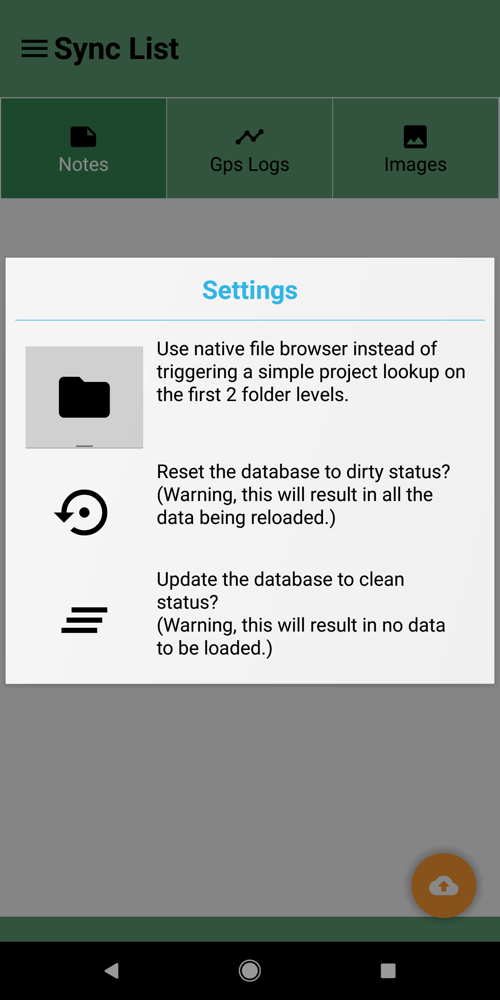
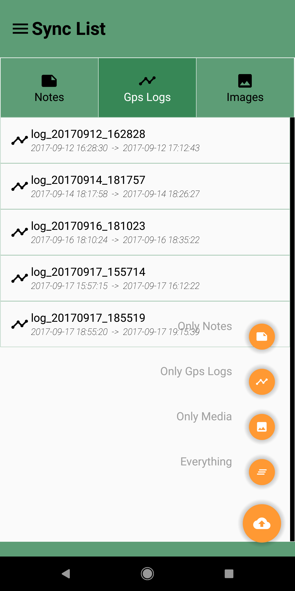

= The Geopaparazzi Survey Server
HydroloGIS S.r.l.
v2.10, 2018-08-23
:gss_version: v2.10
:doctype: article
:description: A description
:encoding: utf-8
:lang: en
:toc: left
:toclevels: 4
:numbered:
:experimental:
:reproducible:
:icons: font
:listing-caption: Listing
:sectnums:
:mdash: &#8212;
:language: asciidoc
ifdef::backend-pdf[]
:title-logo-image: image:logo.png[align=center]
:source-highlighter: rouge
//:rouge-style: github
//:source-highlighter: pygments
//:pygments-style: tango
endif::[]
:stem:

<<<

== The Geopaparazzi Survey Server & Friends

image::logo.png[scaledwidth=30%, width=30%, align="center"]

The Geopaparazzi Survey Server (GSS) is a web application that allows http://www.geopaparazzi.eu[geopaparazzi]
users to synchronize their project data with a central server.

Its companion is an Android app named **Geopaparazzi Survey Server Sync** (GSSS) 
https://play.google.com/store/apps/details?id=com.hydrologis.gssmobile[available on google play].
The app can connect to geopaparazzi projects and synchronize the data contained using the unique device ID to
upload the data to the server.

Any device that connects to the server with its ID, will be accepted and if not available, the new id is 
automatically inserted in the central db.

The applications are available as Free and Open Source software. The server is available under EPL v2.0, while the 
mobile app is available under GPL v3.0.

== The server

=== Installation

The GSS server available as docker image from the https://hub.docker.com/r/moovida/gss/[docker hub]. As such
it works only on linux systems that have docker installed. Describing the installation of docker goes beyond this
documentation. Many tutorials are available in the net to install docker.

.GSS on hub.docker.com.
image::images/01_hub.png[scaledwidth=70%, width=70%, align="center"]

To install the docker image just open a terminal and type in from shell:

[source,bash,subs="attributes+"]
----
docker pull moovida/gss:{gss_version}
----

This will download the server image and install it on your machine.

The installation process should reveal something similar to the following (the version number will most probably be different):

.GSS installation process.
image::images/02_install.png[scaledwidth=70%, width=70%, align="center"]

[NOTE]
====
And once finished, the image should be visible with the command:
[source,bash]
----
docker images
----
====

=== Preparing the data folder

To run GSS you can prepare the data folder for the server, which will contain 
the database (if it doesn't exist, it is created from scratch), some styling 
components and optional mapsforge *.map files for local tiles generation.

NOTE: You can just start with an empty folder, which will be filled with the bare minimum necessary 
to run GSS.

Let's assume you are a heavy lifter and want to do things on your own, and that the data folder 
is named TESTGSS, then the folder structure needs contain at least the following:

----
TESTGSS/
|-- DATA    <-- folder
|   |-- images.png
|   `-- notes.png
`-- WORKSPACE    <-- folder
----

Where **images.png** and **notes.png** are the images that will be used in the map view to style
geopaparazzi notes and media notes.

=== Run the server

To run the GSS server, it is necessary to define a few things:

* the path to the data folder
* the port that needs to be used
* the docker image to use

Assuming we want to run the application on the data folder defined before and on port 8080,
the command to run the application is:

[source,bash,subs="attributes+"]
----
docker run -v /media/hydrologis/Samsung_T3/TESTGSS:/home/basefolder -p 8080:8080 moovida/gss:{gss_version}
----

Open your favorite browser and enter the url:

----
http://localhost:8080
----

You should get the following login screen:

.The GSS login screen.
image::images/03_login.png[scaledwidth=100%, width=100%, align="center"]

This already means that you are ready to rumble!

You can login with:

* user: god
* password: god

Which already tells us that the user has quite some admin rights.

Once logged in, the dashboard view is shown.

=== GSS Views

The GSS views are organized as follows:

The upper toolbar features the menu button on the left, through which the side toolbar can be hidden. At the very right
of the toolbar the currently logged user is shown.

The left toolbar contains buttons to access the available views:

* Dashboard
* Map View
* Settings
  - Surveyors
  - Web Users
  - Map Chooser
* Export
  - PDF
  - KMZ

==== The dashboard

The dashboard view shows a simple chart listing the amount of information for each device.

If no data are available, as in our inizial case, the folloing will be shown:

.The empty dashboard.
image::images/04_dashboard.png[scaledwidth=100%, width=100%, align="center"]

If instead data are available, the dashboard will give some information about the work in progress:

.The dashboard.
image::images/04_dashboard2.png[scaledwidth=100%, width=100%, align="center"]

==== The mapview

The mapview features the Surveyor list and a map panel.

.The mapview with the surveyors list.
image::images/05_mapview.png[scaledwidth=100%, width=100%, align="center"]

The surveyor can be actived by selecting the checkbox in the table. Once the data of the 
surveyor are loaded, through the zoom button on top of the table it is possible to zoom to 
the surveyor's data extent.

.The mapview zoomed on the data of a surveyor.
image::images/06_surveyor.png[scaledwidth=100%, width=100%, align="center"]

If data are uploaded while on the map view, one can either reload the view by refreshing the page
or:

* using the first button to reload the data of the currently loaded surveyor
* using the last button to reload all the available surveyors

The data can be queried by clicking on them. Simple information is shown as described below.

In the case of notes, the main note text, the elevation and the timestamp are shown. Note that 
for notes that have forms, the complex form is not visualized in the information box.

.Notes.
image::images/08_notes.png[scaledwidth=25%, width=25%, align="center"]

For GPS logs the name of the log and the start and end timestamp are shown.

.Gps Logs.
image::images/09_logs.png[scaledwidth=30%, width=30%, align="center"]

For media notes it is possible to visualize the images, by clicking on the image icon.

.Media notes.
image::images/10_media.png[scaledwidth=70%, width=70%, align="center"]

==== The Settings Views

Selecting the proper action from the settings menu it is possible to:

* Configure surveyors. Surveyors can be added or removed. Note that only 
  surveyors registered are able to connect with the mobile app.
  Editable attributes can be changed by double-clicking on the surveyor. 
  **Warning: removing a surveyor will also delete all its data.**

.Surveyor configuration.
image::images/12_surveyors.png[scaledwidth=100%, width=100%, align="center"]

* Create web users and groups. There are two levels of users: admins and normal users.
  
.Web users configuration.
image::images/11_users.png[scaledwidth=100%, width=100%, align="center"]

* Configure background maps. Several map services can be added to the background 
  maps that can then be selected in the mapview. 

.The background maps configuration.
image::images/13_maps.png[scaledwidth=100%, width=100%, align="center"]

WARNING: Many of the available map services need a license key to be accessed 
and/or have particular requirements to be used. Make sure that you have the 
rights to use the maps you select.

==== The Export Views

Selecting the proper action from the export menu it is possible to:

* Export the data of one or more surveyors as PDF:

.The PDF export view
image::images/14_export_pdf.png[scaledwidth=100%, width=100%, align="center"]

* Export the data of one or more surveyors as KMZ:
  
.The KMZ export view
image::images/15_export_kmz.png[scaledwidth=100%, width=100%, align="center"]

== The mobile app, GSSS

The GSSS can be installed from the https://play.google.com/store/apps/details?id=com.hydrologis.gssmobile[play store].

.GSSS on play store.
image::images/16_mobile_install.png[scaledwidth=70%, width=70%]

Once installed and launched it will complain about the fact that no project database has been chosen yet:

.First start of GSSS.
image::images/16_mobile_start.png[scaledwidth=30%, width=30%]

In the side menu it is possible to access several features.

.The main menu.
image::images/17_mobile_menu.png[scaledwidth=30%, width=30%]

The first thing to do is to check if the device has an own unique device id. If it
has one, the following screen will be shown:

.The device id.
image::images/17_mobile_menu_id.png[scaledwidth=30%, width=30%]

This is also the id that the server part uses as device identifier.

If no id is available, the user will be prompted to insert one.

To be able to connect to the GSS server, the url of the server needs to be inserted. 
The url has to end with **upload**:

.The upload URL of the server.
image::images/17_mobile_menu_url.png[scaledwidth=30%, width=30%]

From the side menu it is also possible to access some basic settings:

1. the possibility to reset the connected database to be in a complete 
   dirty state. After that the database will upload everything as if it never
   had done before.
2. the possibility to reset the database to a clean state. After that 
   no data are synchronized. Only new data surveyed in geopaparazzi
   will be uploaded again.

.The settings dialog.

Once the app is configured, it is possible to load a project (first entry
of the menu). A filechooser of dialog will open to select the database to
synchronize. Once loaded the list of notes, gps log and media notes 
are shown in the tabbed view:

.The content of the database that can be synchronized.
image::images/19_mobile_load.png[scaledwidth=30%, width=30%]

Also, at the bottom of the main menu, the path and name of the database are shown:

.The path and name of the connected database.
image::images/19_mobile_menu_loaded.png[scaledwidth=30%, width=30%]

To synchronize, the floating action button at the bottom right part can 
be used. It is possible to synchronize everything or just a part.

.The action button that allows to upload notes, logs, media or everything.

Once the button is pushed, the app connects to the GSS server and sends 
the selected data to the server. At the end 

.The dialog of a successful sync.
image::images/21_mobile_syncdone.png[scaledwidth=30%, width=30%]

=== Troubleshooting

If you experience issues or problems of any kind, you can use the **send debug log**
button to send some debug information about the error to the developers. This will help them
to solve the issue and create a new release.

.The send log button.
image::images/22_send_log.png[scaledwidth=30%, width=30%]

